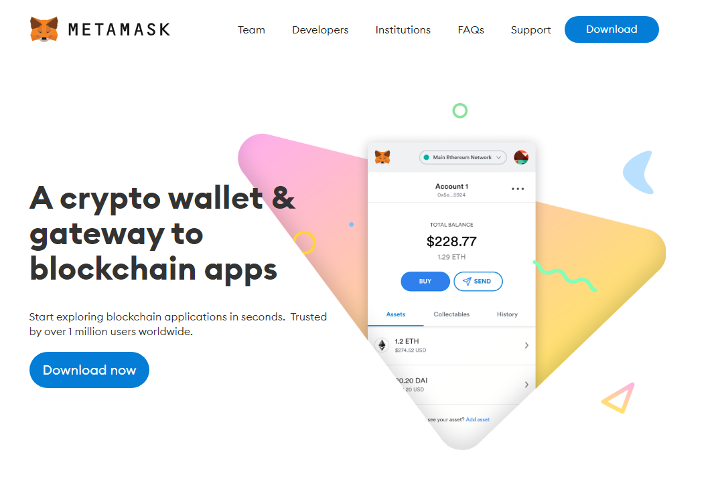
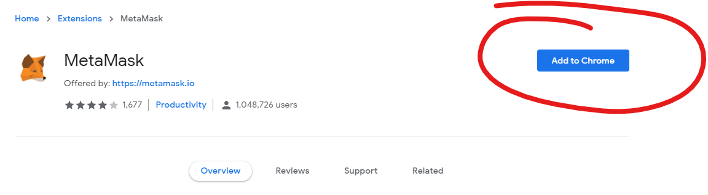
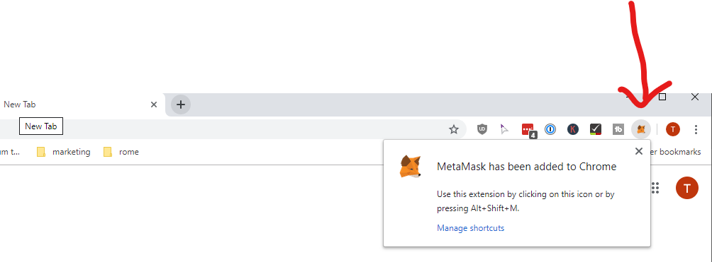

# Installing MetaMask

Firstly, we are going to install MetaMask. That is a browser plugin which can securely store private keys and connect to different blockchains.

How this exactly works is something we discuss later. For now we just play around.

## Download MetaMask

Open <https://metamask.io> and download the plugin for your browser

!

!

!

Perfect, that's it. Now, let's setup MetaMask and make it secure.