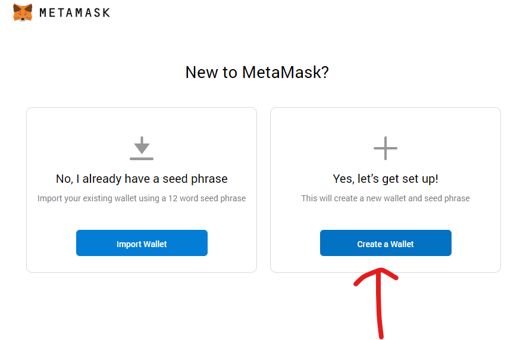
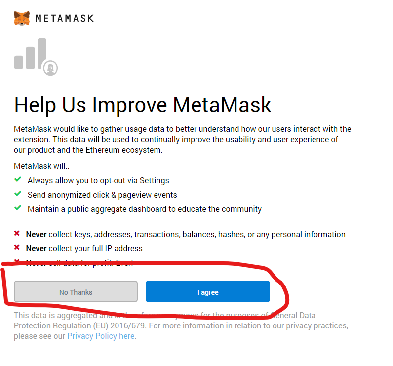
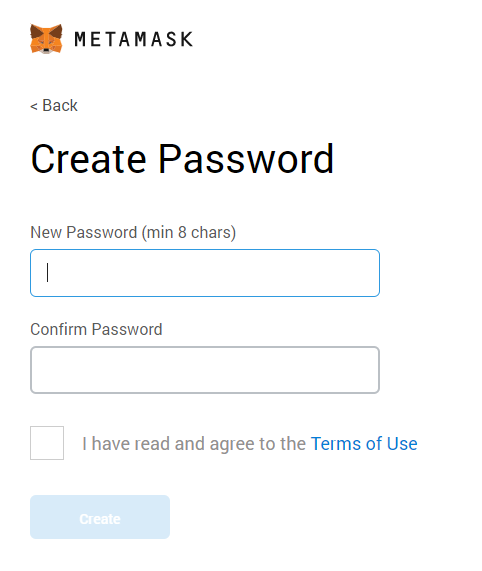
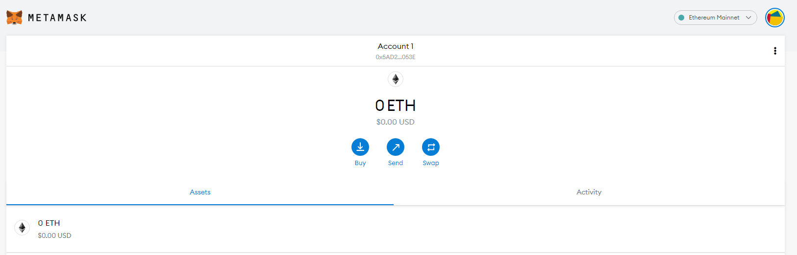

# Setup MetaMask

When you install MetaMask, then it will automatically open up a "setup" page. 

Hit "Begin" and walk through the setup-wizard. Let's create a new Wallet!

!

## Statistical Information 
If you want to send statistical information, is totally up to you, both
is fine:

!

## Set a Password

Create a new *strong* password. This password is used to encrypt your
private keys. What private keys are exactly is discussed in a later
section of the course, suffice to say though, they give access to *all
your Ether*. So, better have a strong password here:

!

## Backup Phrase 
It would be better to safely store the secret phrase, but for sake of
simplicity, let's just skip this for now:

!

!!! note "Seed Phrase"
    A seed phrase (or here: Backup Phrase) is usually a number of human-readable words (e.g. 12 words). This represents the "master key" to regain access to all your accounts. It is a simple algorithm to create a number of private keys based on your backup phrase. Don't worry if you don't know yet what this means - just remember: Never (like __never ever__) give out your seed phrase!

## Final Screen

And you should be greeted with this screen:

!

Let's see now how we can use MetaMask to transfer Ether...

