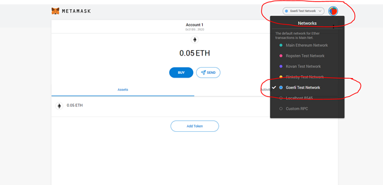
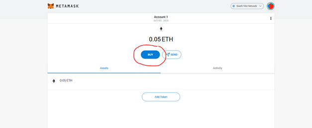
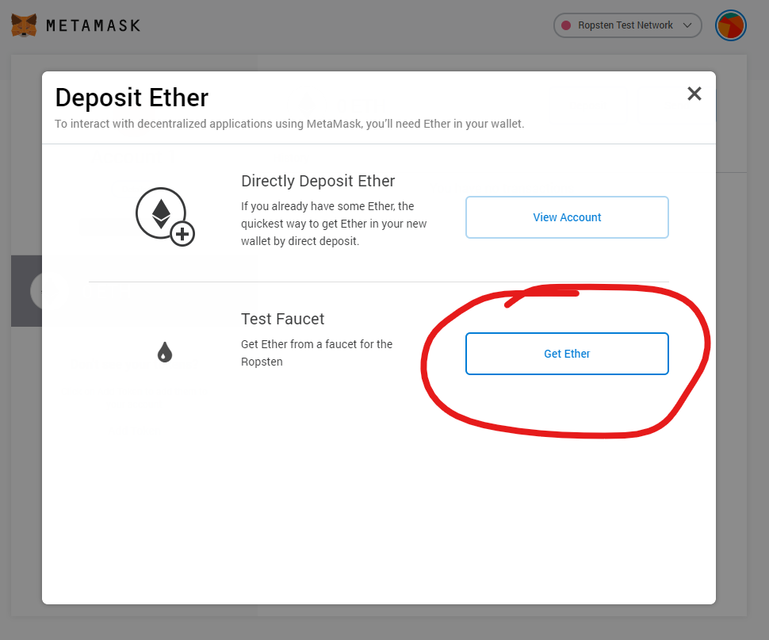
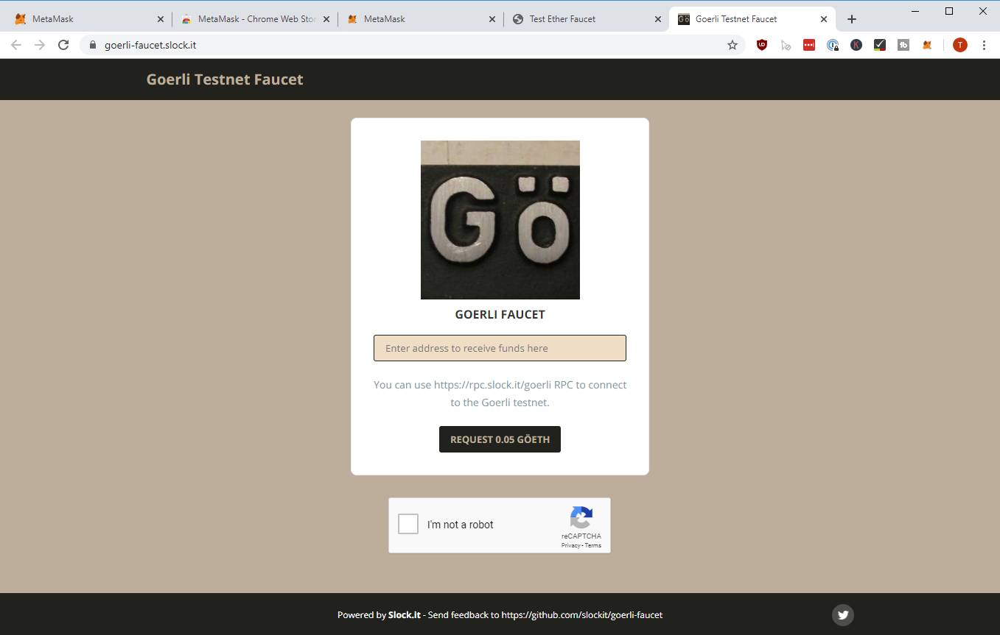
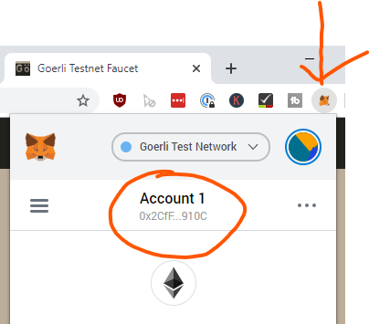
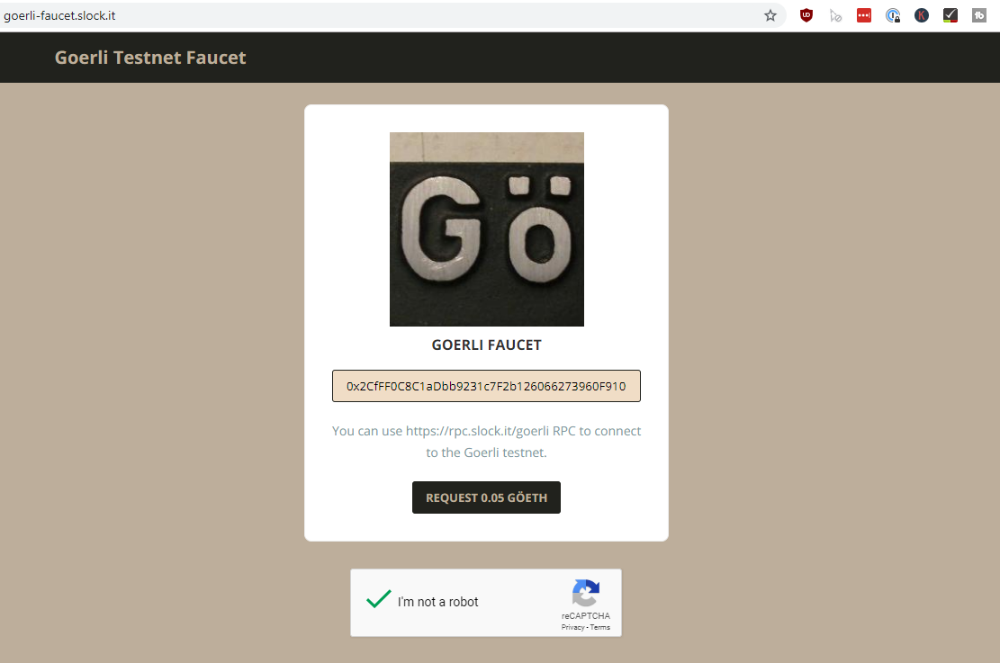
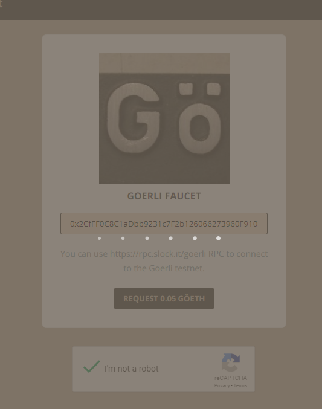
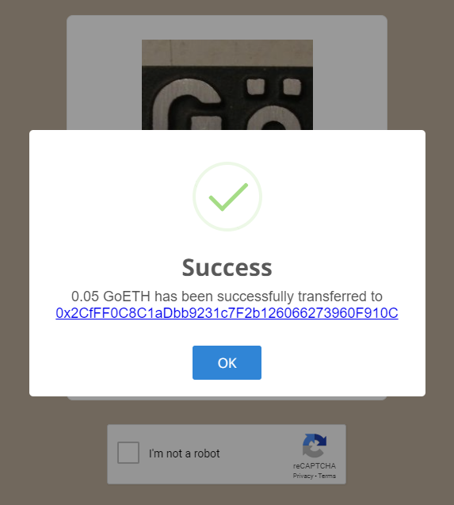

# Get Test-Net Ether

If you have never worked with blockchains before, then the first confusing this you will encounter is: There is not one blockchain, but _many_ different blockchains. I am talking about Ethereum Blockchains.

It's like having different databases. But only one is considered the "Main" Database, or "Mainnet". 

There are also other blockchains, for testing different aspects. Each of those have usually a name and a specific network and chain id. There is no central list of them, because everyone can open their own blockchain, but here's a good [overview](https://ethereum.stackexchange.com/questions/17051/how-to-select-a-network-id-or-is-there-a-list-of-network-ids/17101#17101){target=_blank}.

In this tutorial, we will use either Ropsten or Görli to get Test-Ether and start a transaction.

## Get Görli Test-Ether

Switch the network to Goerli. 

!!! note "Network Selection"
    Attention here: some of the pictures have "Ropsten" selected, but the Ropsten test-network had a couple of hiccups, so I recommend Goerli instead!

!!! note "List of ETH Testnet Faucets"
    Sometimes Faucets don't work as expected. Unfortunately there is nothing much that I can do about it. It is time intensive to run a faucet and usually it doesn't pay off economically. Here is a list of Faucets in case the one here doesn't work, you can probably switch to another one:

    My current go-to Faucet I really like for all networks:
    [https://faucet.paradigm.xyz](https://faucet.paradigm.xyz)

    _Ropsten_:
    <https://faucet.metamask.io>

    _Rinkeby_:
    <https://faucet.rinkeby.io>
    <https://www.rinkebyfaucet.com>
    <https://app.mycrypto.com/faucet>
    <https://faucets.chain.link/rinkeby>

    _Kovan_:
    <https://gitter.im/kovan-testnet/faucet> basically post your eth address in the gitter chat

    _Görli_:
    <https://goerli-faucet.slock.it/index.html>
    <https://faucet.goerli.mudit.blog>
    
    Another "special edition" Faucet is maintained by Keir "Blockchain-Gandalf" Finlow-Bates, who also wrote a great book about Blockchains. He tries to maintain it as good as possible and it outputs Ropsten Ether: <https://moonborrow.com>

    _Kintsugi (Eth2.0)_:
    <https://kintsugi.themerge.dev>

!

Hit "BUY"

!

Click on "Get Ether"

!

A new website should open up. That's the faucet to get Ether. A Faucet
is like a "get free Ether" -- site. The Ethers are having no value, they
are running under a "test" Blockchain, but they are great for getting
your feet wet with transactions and how Wallets work.

!

Copy your Address from MetaMask by clicking directly on the address:

!

Paste it into the Goerli Faucet Value Field and hit "I'm not a robot"
and "Request 0.05 GÖETH"

!

Wait until the popup appears...

!

!

Don't click the link of the transaction, most likely it will not really work anyways. Let's track our Incoming Transaction in the next step!

