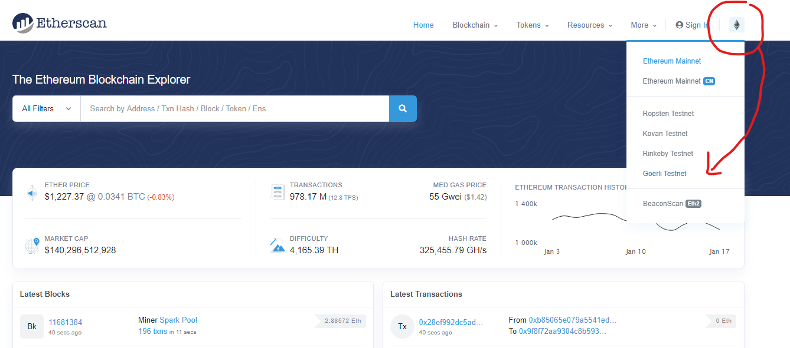
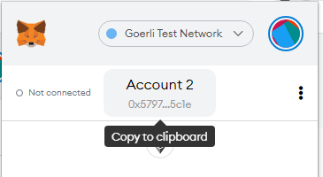
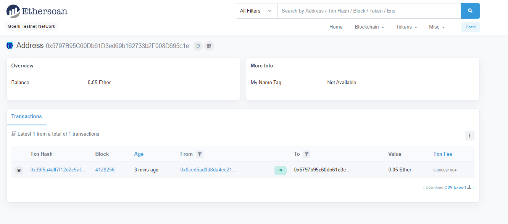
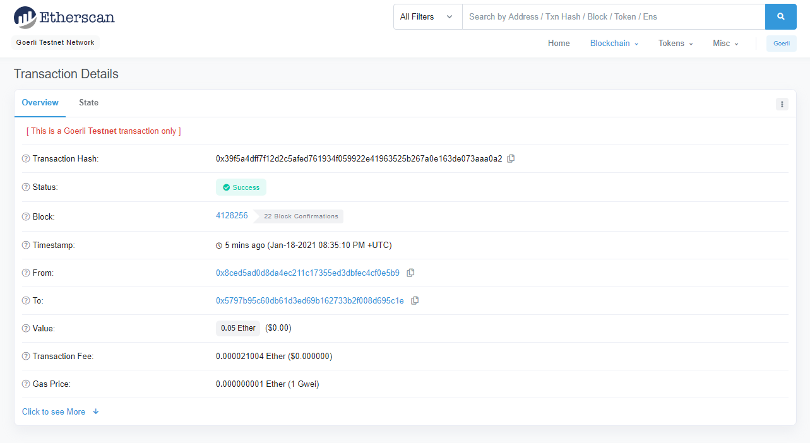
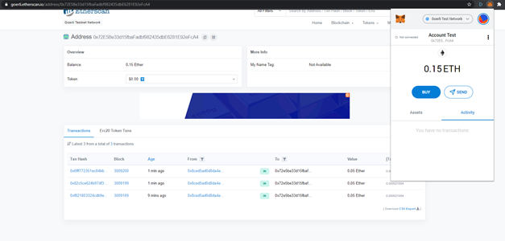

# Track Ether

You might have heard it: all information on the Ethereum Blockchain is publicly visible information. So, if someone sends a transaction from A to B, then this is visible to all participants in the network.

There is specialized software to track those transactions, so called "Block explorers". One of them is [Etherscan](https://etherscan.io){target=_blank}.

Go to <https://etherscan.io/>{target=_blank} and click the Ethereum logo at the top right and
choose Goerli testnet.

!

You should be at <https://goerli.etherscan.io/>{target=_blank}. Copy and paste your address or copy the transaction hash from the previous step and paste it, either way, you should find a transaction that leads back to your wallet address:

!

!

!

You should see your transaction with the success message and all the
details of the transaction.

Now open MetaMask from your browser and you should see some ETH in your
wallet *on a test-net.* 

!!! note "Video / Screenshots difference"
    Note: I have 0.15ETH in my wallet, because I did this procedure 3 times for the screenshots.

!

That's it. You have now installed a wallet and you have your first Ether ready. Let's carry on with the next steps!