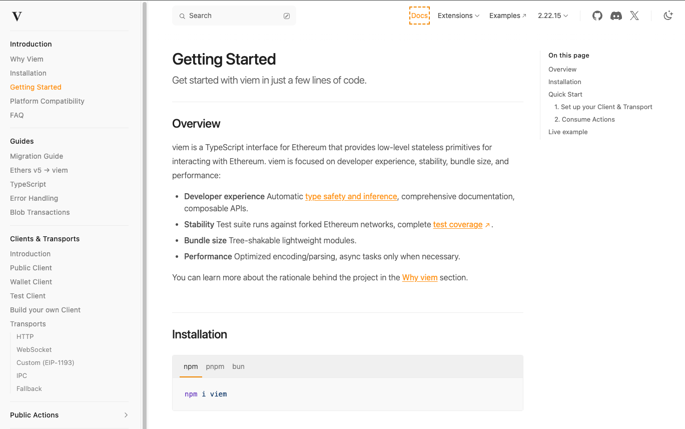
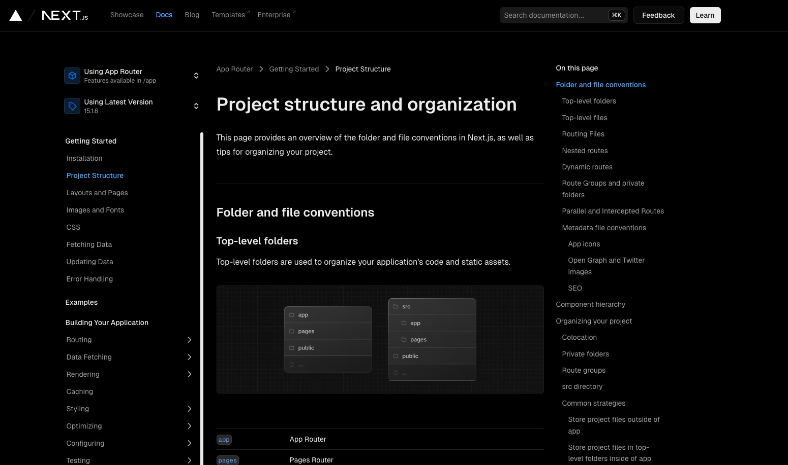
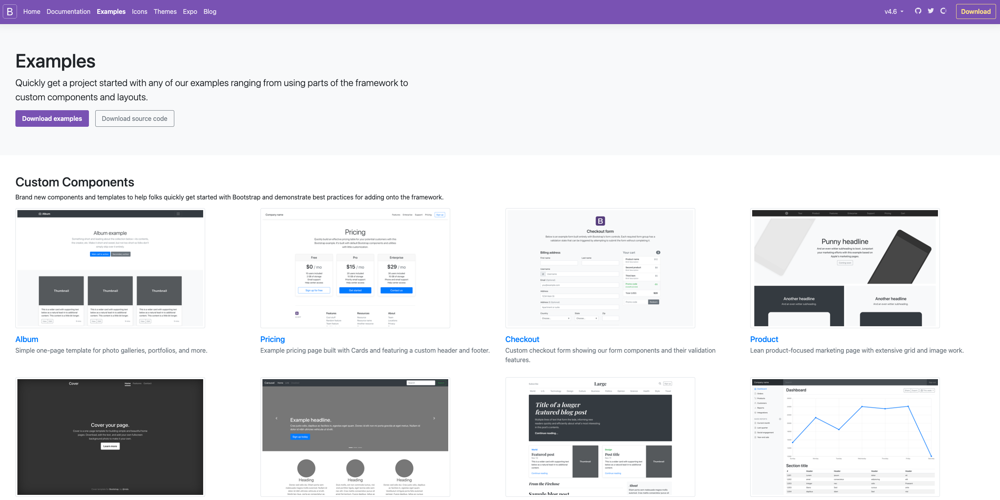
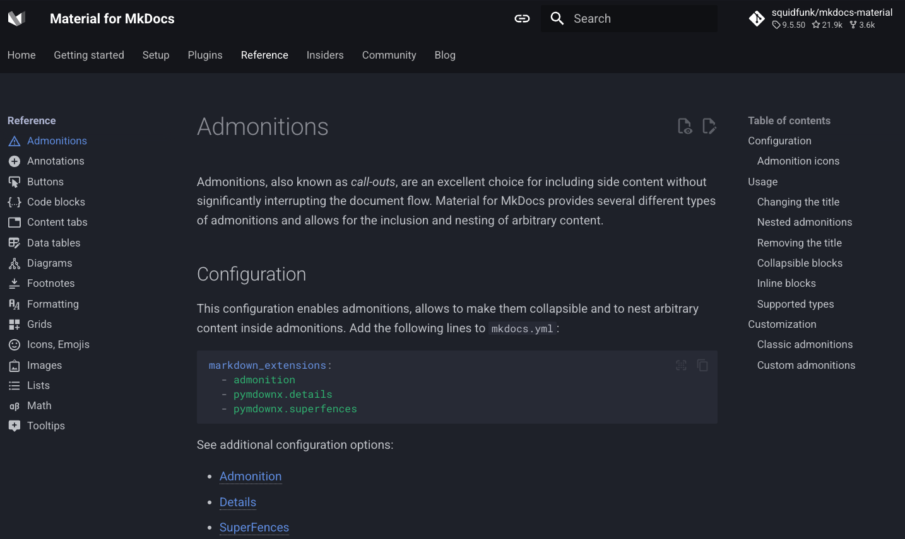
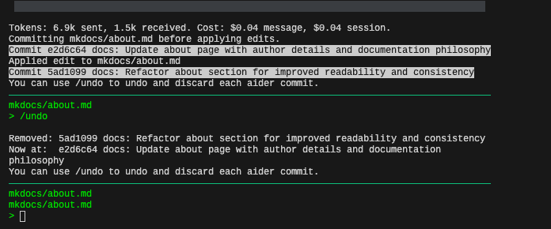

# About MkDocs-Shadcn

Hi, I'm Thomas, the author of MkDocs-Shadcn. 

I'm a sucker for fast, developer friendly, great looking docs. 👋🏻

Great docs are the reason I got lured into so many projects and ideas. From Web2 to Web3 Development and everything in between. 

!

From PHP to Solidity, from Jquery via Angular to NextJs. Great looking docs, with step by step examples are essential for me to start on something new. 

!

_Show and tell._

I think awful looking, incomplete, out of date, inconsistent and/or slow docs are the reason so many great projects died.

## Why MkDocs-Shadcn

On a HN-comment someone said something like "shadcn is the modern bootstrap". That person did not mean it in a good way. However, I think its great for docs! When I (as a developer) look at docs, I want consistent design. I want to "feel at home".

Shadcn brings to Next.js what Bootstrap brought to traditional websites: consistency.

!

When looking at docs, I think there are a few basic expectations we have:

- A well-organized sidebar (or menu)                                                              
- Proper code highlighting                                                            
- Clean typography and eye-friendly layout                                                   
- Simple, but efficient search functionality  

Admittedly, I am not a designer, but with shadcn and tailwind, a lot of the things come out of the box. And they are consistent.

But, why MkDocs-Shadcn over regualr MkDocs or MkDocs-Material?

## MkDocs-Shadcn vs MkDocs-Material

MkDocs-Material is an excellent free, open-source static content generator built on the Material theme. It looks great and leverages Python-based Markdown processing with impressive parsing capabilities.

It really looks just great out of the box. And I love it. I recommended it to so many projects, its really a no-brainer to use for docs.

!

Making it work with server side dynamic code is a nightmare.

If you are hosting a project where you want interactive code samples, server side functionality, like memberships, comments etc, you're out of luck (or need to add something with iframes etc). I did try parse the static html from MkDocs-Material via an Express.js webserver to add AWS Cognito membership areas. It was no fun, or maybe it was, but its definitely not "the way it should be".

What I actually wanted was to take my markdown files I worked on for two years, drop them into a NextJs project and "just parse them"™️. How hard can it be? Turns out, pretty hard. But here it is, MkDocs-Shadcn, my (limited) drop-in replacement for MkDocs-Material.

I think NextJs has evolved into a great framework for starting a smaller business with an MVP and a landing page. This is where MkDocs-Shadcn comes in. Out of the box you get great looking docs, add whatever else NextJs functionality you need, and have a great looking starter site for an MVP very very quickly.

## Coding with the help of AI and LLMs

This project was in part done with the help of Aider and Sonnet 3.5. In fact, Aider is the reason this project even started. One weekend I sat there and thought "lets see what Aider can do" and started with a simple prompt. And then more prompts followed. I learned Aider is a great way to do all the boilerplate code I don't want to write anymore and I intend to keep using it for bugfixes or feature requests. It's not so good for actual code architecture, but that's ok.

!

I'll keep using Aider. If you are writing a github issue or a feature request, it would be great to be able to copy/paste the request directly into Aider to prompt the LLM for (simple) changes, it will ease the development a lot.

## Community?

Is there a community or how to get in touch? There's none at the moment. I offer this project, which I will use to host my ethereum-blockchain-developer.com course documentation, as a free download and docs-starter project for everyone.

May the world have better docs 🤘🏻
