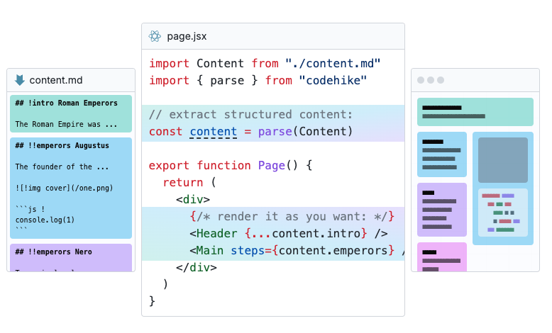
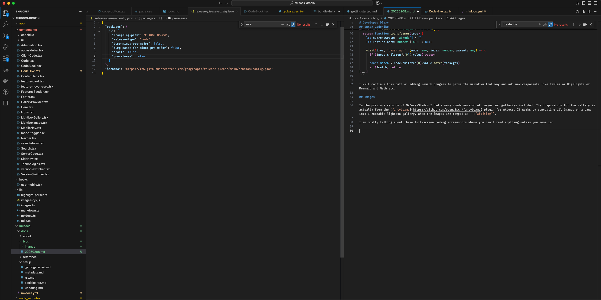
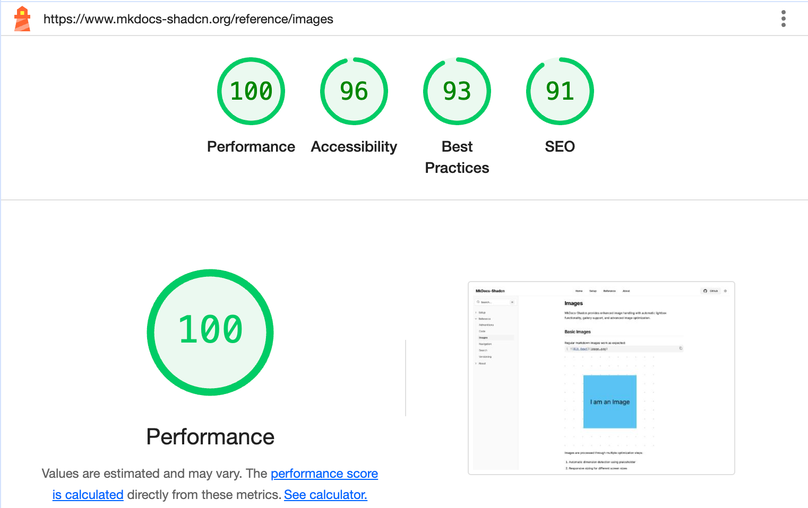
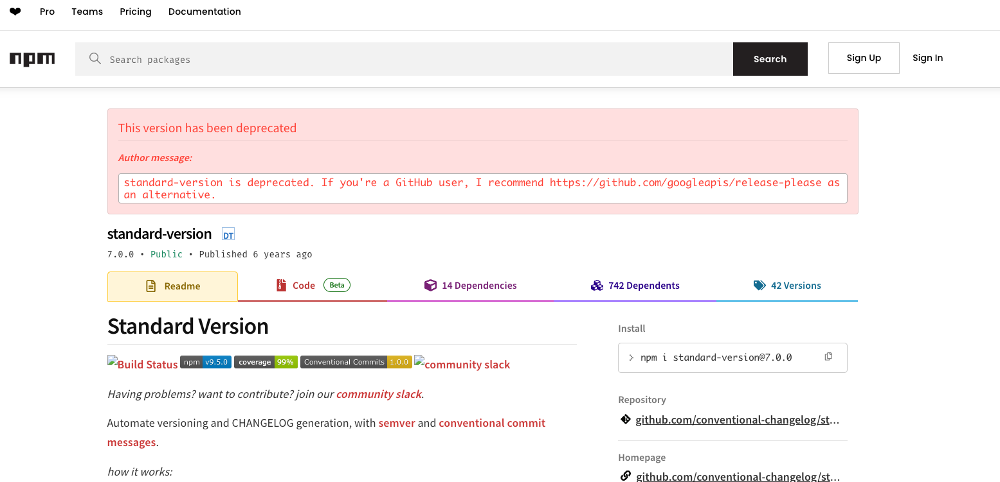

# Developer Diary

It's time to share a few stories of what happend since the last release.

## 2025-02-08

Today I want to share something about remark plugins and conventional commits.

I started MkDocs-Shadcn with a simple idea: parse the markdown into jsx tags and then render out components that look like MkDocs-Material. My first attempt was a regex based parser. The idea was pretty simple. For example admonitions: take the markdown, search for something like `!!!\s(\w+)\s?"([^"]+)` and then convert this into an admonition. Or search for `!` and you know its a gallery image. Etc.

Something like this would convert the links to markdown links before its gets processed by mdx:

```ts
 // Convert MkDocs-style links to markdown links
  processedContent = processedContent.replace(
    /<(https?:\/\/[^>]+)>/g,
    (match, url) => `[${url}](${url})`
  );
```

That works for a bit, until it doesn't.

## Enter CodeHike

One of the best tools I came across in my Markdown journey is [CodeHike](https://codehike.org/). 

I was searching for a simple solution to the Code Fenced code highlights to highlight all sorts of code, and codehike does that really well. They also do a lot more, like code journeys and visualizations etc.



One of the [blog posts](https://codehike.org/blog/build-time-components) there breaks down Remark and Rehype really well, and that actually gave me the confidence that I can move my simple regex based parser to a remark plugin based parser.

I have successfully converted the Admonitions, the Images and the Tabs to Remark Plugins. I am thinking to spin this further and actually make an NPM package out of this, so anybody can just add remark plugins to their MDX config to parse any mkdocs-material properly and get nice looking shadcn components. But until I have a decent amount of feature coverage, I will continue like this for now.

For example, the [remark-tabs](https://github.com/tomw1808/mkdocs-shadcn/blob/main/plugins/remark-tabs/index.ts) still parses parts with a regex, but overall its much cleaner, because its walking on nodes and node-children on a Markdown Abstract Syntax Tree instead of pure plaintext based parsing:

```ts
[...]
const tabRegex = /^===\s+"([^"]+)"\s*$/

export const remarkTabs: Plugin = function() {
  return function transformer(tree) {
    let currentGroup: TabNode[] = []
    let lastTabIndex: number | null = null
    
    visit(tree, 'paragraph', (node: any, index: number, parent: any) => {
      if (!node.children?.[0]?.value) return

      const match = node.children[0].value.match(tabRegex)
      if (!match) return
[...]
```

I will continue this path of adding remark plugins to parse the markdown that way and add new components like Tables or Highlights or Mermaid and Math etc.

## Images

In the previous version of MkDocs-Shadcn I had a very crude version of images and galleries included. The inspiration for the gallery is actually from the [fancyboxmd](https://github.com/opengisch/fancyboxmd) plugin for mkdocs. It works by converting all images on a page into a zoomable lightbox gallery, when the images are tagged as `!`. 

I am mostly talking about these full-screen coding screenshots where you can't read anything unless you zoom in:

!

Some of the screenshots I provide in my docs are detailed screenshot. But sometimes you need to give users the "overview" of something. And that's where I really enjoy to provide this to my audience. Anyways, I deemed it useful, and so its in there.

Enter [Plaiceholder](https://plaiceholder.co/docs), a "suite of server-side functions for creating low quality image placeholders (LQIP)" and basically the thing that helps you lazy load images to achieve that sweet 100 lighthouse score:



I know, its not there in terms of SEO and so on. But, I am coming from backend coding. And frontend optimization is entirely new to me. The fact that I even got that far is a surprise and reason to celebrate. Room for optimization just means you need to follow me on my journey to know when I get to 100 SEO :)

Sidenote: I also spent a considerable amount of time generating several src images for different resolutions to minimize the gap (padding) between the text and image on different devices. It should look good pretty much everywhere now.

## Repository Maintainer

MkDocs-Shadcn is also the first repository where I was looking into a proper "public repository maintainance" workflow. 

I asked chatgpt what I should do. It told me vaguely a few things and said:


> ## Repository Structure & Workflow
> 1. Use a Clear Branching Strategy
>   - Keep main (or master) as the stable, production-ready branch.
>   - Use feature branches (feature/xyz), bugfix branches (fix/xyz), and hotfix branches (hotfix/xyz).
>   - Merge feature branches via Pull Requests (PRs) to ensure code review and history tracking.
>     
> 2. Write Good Commit Messages
>   - Keep them clear and descriptive.
>   - Format: 
>       - type(scope): short description, e.g.,
>       - feat(api): add user authentication
>       - fix(ui): resolve navbar overlap on mobile
>       - docs(readme): update installation guide
>
> 3. Use GitHub Issues & Discussions
>
>   - Issues: Track bugs, enhancements, and features.
>   - Discussions: Engage with users and contributors outside of strict issue tracking.
>   - Set Up a CONTRIBUTING.md & README.md
>
> README.md: Explain what the project does, how to install/use it, and contribution guidelines.
>
> CONTRIBUTING.md: Outline how people can contribute (e.g., how to open PRs, coding style, and testing).
>
> Automate with GitHub Actions (Optional)
>
> CI/CD pipelines for tests, linting, and deployments.

Some of the things I had already:

✅ The README explains what the project does and how to install it

✅ CI/CD pipelines: They come automatic with Vercel.

✅ Out of lazyness I was working on the main branch only, but that's an easy change. I thought. More on that in a second.

✅ Commit Messages: They follow mostly the [Conventional Commits](https://www.conventionalcommits.org/en/v1.0.0/)


ChatGPT was really really adamant I should use a tool called `standard-version`:

> If you want automated changelogs, use standard-version

But that package is deprecated. It recommends to use a tool called "please-release" from google:



### Please-Release

I went down the complete rabbit hole with [please-release](https://github.com/googleapis/release-please). 

TlDr: Whenever there are enough changes together I'll do a manual release with the please-release-cli tool. 

Please Release workflow is seemingly very simple, though not _exactly_ what I am looking for. 

What I want:

1. Work on a dev branch mostly (think beta/preview/staging).
2. Have the production branch on main
3. Preview dev in Vercel, and if it builds correctly, release to production branch every once in a while
4. I thought I can use please-release to auto-generate the CHANGELOG.md
5. Turns out, I can't.

Please-Release is apparently pretty "simple". It works of commits on a branch. Then opens a PR against that branch, tags that PR branch and creates snapshots.

The problem is, I apparently cannot work on dev and then have the PR against main. Anyways, its creating these beautiful [Changelogs](https://github.com/tomw1808/mkdocs-shadcn/blob/main/CHANGELOG.md) based on the Conventional commits. It also creates [releases](https://github.com/tomw1808/mkdocs-shadcn/releases/tag/mkdocs-dropin-v1.0.0). I am not 100% on board with the versioning, but ok, that's for a future post. Thinking about it, I should probably write more remark-plugins than do the versioning correctly, so, lets use that for now until it bothers someone.

I also installed the [gh cli tool](https://cli.github.com/manual/) to do things like:

```bash
gh issue list

Showing 1 of 1 open issue in tomw1808/mkdocs-shadcn

ID  TITLE             LABELS  UPDATED        
#1  MetaData Parsing          about 1 day ago
```

So, I can also reference github issues in my commit messages. And it should all tie in quite nicely. Let's see.

## What's next?

I don't know. I will try to setup ethereum-blockchain-developer.com with mkdocs-shadcn at some point, click through all the pages and see if everything renders correctly.

It's a sideproject after all. A hobby. Something I do to relax. I do not want to turn this into work. I might work on it 7 days a week or 0. If someone finds it useful and posts issues or even contributes, I'd be very happy.

Stats so far: 

- 1 star on the repository.
- Used in production: 0.

Let's go from 0 to 1 and then see...

