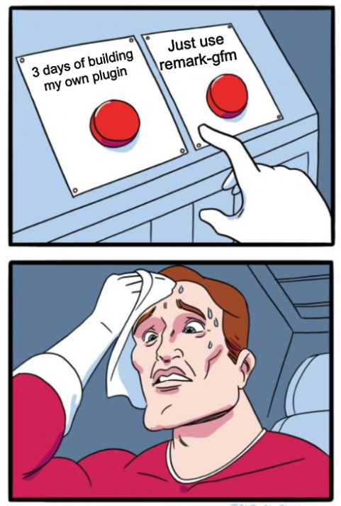

# The Tale of Tables and Footnotes

Sometimes the best solutions are already out there, waiting to be discovered. This is the story of how I learned this lesson (again) while implementing tables and accidentally added footnotes, ~~strikethrough~~ and many other things in MkDocs-Shadcn.

> MkDocs-Shadcn aims to be a drop-in replacement for MkDocs-Material in NextJS.

## The DIY Table Adventure

Like many of you would, I started writing my own remark plugin and tables parser. I mean, come on, its just Tables. And Tables in markdown are pretty straightforward, right?

=== "Code"
    ```markdown
    | Header 1 | Header 2 | Header 3 |
    |----------|----------|----------|
    | Cell 1   | Cell 2   | Cell 3   |
    ```

=== "Result"
    | Header 1 | Header 2 | Header 3 |
    |----------|----------|----------|
    | Cell 1   | Cell 2   | Cell 3   |

How hard could it be to parse this into a shadcn table? So I sat down started crafting a remark plugin. 

The basic structure seemed simple enough:

```typescript
const remarkTables: Plugin = function() {
  return function transformer(tree) {
    visit(tree, 'paragraph', (node) => {
      // Parse table structure
      // Convert to shadcn components
      // What could possibly go wrong?
    })
  }
}
```

Let's skip a few f-bombs and trial and errors, then, after a few iterations, I had something working. Tables were rendering! But there was this sneaky little problem:

```html
<table>
  <thead>
    <thead> <!-- Wait, what? Double thead? -->
      <tr>...</tr>
    </thead>
  </thead>
</table>
```

My beautiful tables had nested `thead`s. No matter what I tried, shadcn's TableHeader component kept wrapping itself in another `thead`. It was like trying to solve a puzzle where someone keeps adding extra pieces when you're not looking.

Here's what the final implementation looked like (abbreviated for clarity):

```typescript
interface TableNode extends Node {
  type: 'remarkTable'
  children: (TableHeader | TableBody)[]
  data: {
    hName: 'Table'
    hProperties: {
      className: string
    }
  }
}

export const remarkTables: Plugin = function() {
  return function transformer(tree) {
    visit(tree, 'paragraph', (node: any, index: number, parent: Parent) => {
      // Parse table structure from markdown text
      const tableNode: TableNode = {
        type: 'remarkTable',
        children: [
          {
            type: 'remarkTableHeader',
            data: { hName: "thead" },
            children: [{
              type: 'remarkTableRow',
              data: { hName: "tr" },
              children: headerCells.map(cell => ({
                type: 'remarkTableCell',
                data: {
                  hName: 'th',
                  hProperties: {
                    className: cell.align === 'right' ? 'text-right' :
                              cell.align === 'center' ? 'text-center' : 
                              'text-left'
                  }
                },
                children: [{ type: 'text', value: cell.content }]
              }))
            }]
          },
          // Similar structure for table body...
        ],
        data: {
          hName: 'Table',
          hProperties: { className: 'my-6' }
        }
      }
      
      // Replace paragraph with table
      parent.children.splice(index, 1, tableNode)
    })
  }
}
```

After some investigation and a full day of debugging (swearing a lot basically, while placing `console.log` statements on every other line), I think that my custom table nodes in the remark plugin were causing a cascading effect in rehype. The rehype processor didn't understand my custom child components and added a default `thead` before adding the `TableHead`, which itself became another `thead` during rendering. I think. To be honest, I am still not sure. But ok, let's continue...

## Enter remark-gfm

After a day of wrestling with nested table headers and questioning my life choices, I did what I probably should have done first: I checked if someone else had already solved this problem.



That's when I discovered remark-gfm (GitHub Flavored Markdown)[^1]. Not only did it handle tables beautifully, but it came with a bonus: footnotes support[^2]!

The solution was a little bit too simple for my taste, but hey, I'll take it:

```typescript
remarkPlugins: [remarkGfm, ...otherPlugins]
```

Fast forwarda few days - my curiosity wasn't satisfied. I wanted to understand why my implementation failed, so I tried one last experiment: making my own remark table plugin the default one instead of remark-gfm. Here's where things got interesting: no matter where I placed my plugin in the `remarkPlugins` array in mdxRemote, it wouldn't render my tables - only the ones from remark-gfm would appear.

This led me down a rabbit hole into the difference between unist and mdast. I got pretty far, almost found the carrot, but ultimately gave up. I think remark-gfm operates at the MDAST (Markdown Abstract Syntax Tree) level, while my plugin was using `unist-util-visit` which works after parsing into the MDAST tree. This would explain why my plugins position in the array didn't matter - remark-gfm was already executing at a different level in the parsing process. At least the internet told me so.

Anyways, I already added remark-gfm (GitHub Flavored Markdown)[^1]. Not only did it handle tables beautifully, but it came with a bonus: footnotes support[^2], and plenty of styles more I wanted to painstakingly integrate into my own remark plugins!

The solution was elegantly simple:

```typescript
remarkPlugins: [remarkGfm, ...otherPlugins]
```

And just like that, tables worked perfectly with shadcn's components:

| Feature | Status | Notes |
|---------|--------|-------|
| Tables | ✅ | With proper alignment |
| Footnotes | ✅ | With tooltips! |
| My sanity | 😅 | Mostly intact |

## The Footnote Enhancement

But I wasn't done yet. While remark-gfm handled the basic footnote syntax, I wanted something more interactive. The default behavior creates a `sup` element where the footnote is referenced and a list item at the bottom of the page. But what if we could show the footnote content right where it's referenced?

This led to the creation of remarkFootnotes, a plugin that enhances footnote references with their content:

```typescript
visit(tree, 'footnoteReference', (node: FootnoteReference) => {
  if (definitions[node.identifier]) {
    node.data = node.data || {}
    node.data.footnoteContent = definitions[node.identifier]
  }
})
```

Now when you hover over a footnote reference like this one[^3], you get an instant tooltip with the content, no scrolling required!

## Lessons Learned

1. Check for existing solutions first (but you probably already knew that)
2. Sometimes the best contribution is building upon what exists
3. There's always room for enhancement, even when using existing tools

The next time you find yourself starting a new feature, remember: you might not need to reinvent the wheel, but you can definitely add some cool spinning rims to it.

[^1]: remark-gfm is a plugin that adds support for GitHub Flavored Markdown features like tables, footnotes, and strikethrough.
[^2]: Footnotes are those helpful little references that let you add extra information without interrupting the flow of your text.
[^3]: Like this one! Hover over the number to see how the tooltip works. Pretty neat, right?
