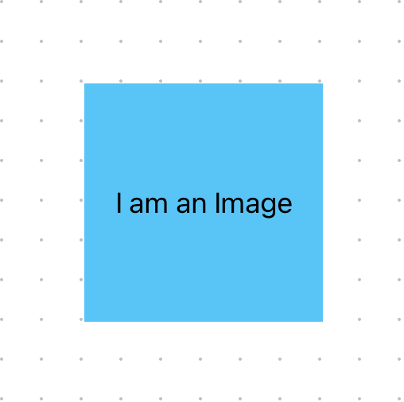
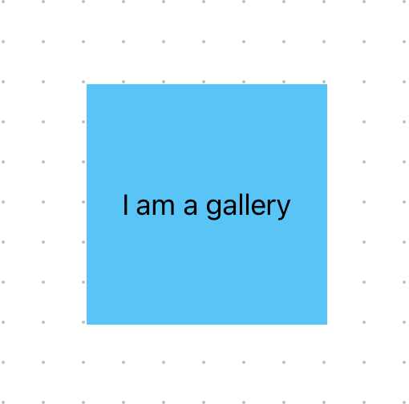
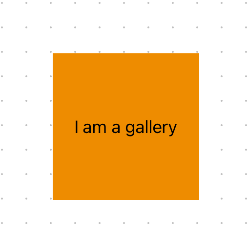

# Images

MkDocs-Shadcn provides enhanced image handling with automatic lightbox functionality, gallery support, and advanced image optimization.

## Basic Images

Regular markdown images work as expected:

```markdown

```



Images are processed through multiple optimization steps:

1. Automatic dimension detection using plaiceholder
2. Responsive sizing for different screen sizes
3. Blur placeholder generation for smooth loading
4. Next.js Image optimization
5. Proper aspect ratio preservation

## Lightbox Gallery

To enable lightbox functionality for an image, use double exclamation marks:

```markdown
!
!
!
```

All images marked with double exclamation marks on a page are automatically collected into a gallery. When you click any of these images:

1. The image opens in a lightbox overlay at full resolution
2. You can navigate through all gallery images using arrow keys or buttons
3. The lightbox can be closed by clicking outside or pressing ESC
4. Images maintain their aspect ratio without letterboxing

!

!

## How It Works

The image handling system uses modern React and Next.js features:

1. A remark plugin that transforms markdown image syntax into React components
2. Plaiceholder for automatic image dimension detection and blur placeholders
3. Next.js Image component for optimal delivery and caching
4. React Server Components for efficient image processing
5. Responsive design with dynamic sizing
6. Client-side gallery management with React context

## Image Processing

Images are processed through multiple stages:

1. The remark-images plugin detects and transforms image syntax
2. Server-side processing:
   - Automatic dimension detection
   - Blur placeholder generation
   - Responsive size calculations
   - Format optimization
3. Client-side features:
   - Lazy loading
   - Progressive enhancement
   - Smooth transitions
   - Responsive sizing

Images can be placed in the same directory as your markdown files or in subdirectories. The paths are always relative to the markdown file's location. For example, if your documentation structure looks like this:

```
mkdocs/
  ├── getting-started.md
  ├── images/
  │   ├── diagram.png
  │   └── screenshots/
  │       └── interface.png
  └── advanced/
      ├── feature.md
      └── images/
          └── workflow.png
```

You can reference these images in your markdown files like this:

```markdown
# getting-started.md

!

# advanced/feature.md

```

MkDocs-Shadcn automatically:
1. Detects all referenced images
2. Copies them to the appropriate location in the public directory
3. Processes them using Next.js Image optimization
4. Updates all references to use the correct public paths

This happens both during development (when running the dev server) and at build time.

## Example

Here's an example using both regular and lightbox images:

```markdown
# My Page

Regular image:


Lightbox enabled image:
!
!
```

The lightbox-enabled images will be part of the same gallery and can be navigated through when opened, regardless of their original location in the documentation structure.
