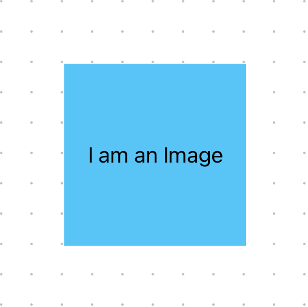
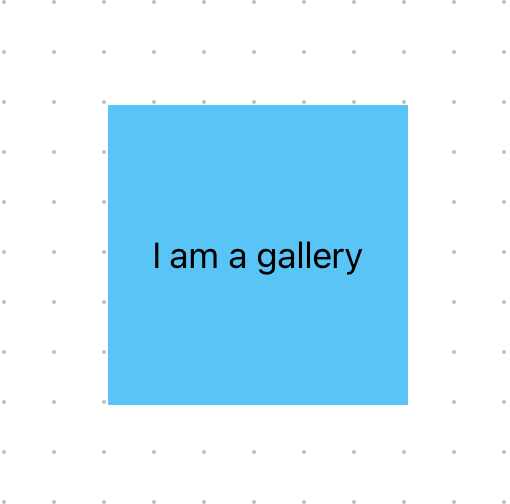
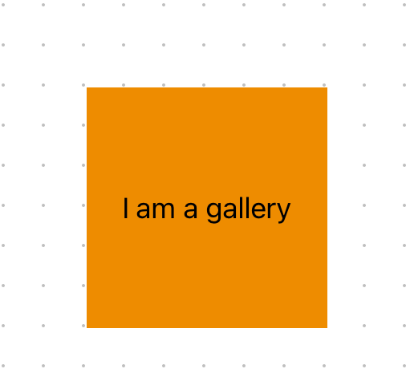

# Images

MkDocs-Shadcn provides enhanced image handling with automatic lightbox functionality and gallery support.

## Basic Images

Regular markdown images work as expected:

```markdown

```



These images are automatically optimized using Next.js Image component and properly served from the public directory.

## Lightbox Gallery

To enable lightbox functionality for an image, use double exclamation marks:

```markdown
!
!
!
```

All images marked with double exclamation marks on a page are automatically collected into a gallery. When you click any of these images:

1. The image opens in a lightbox overlay
2. You can navigate through all gallery images using arrow keys or buttons
3. The lightbox can be closed by clicking outside or pressing ESC

!

!

## How It Works

The image handling system consists of several components:

1. A markdown preprocessor that detects special image syntax (`!`)
2. A `LightboxImage` component that handles individual images
3. A `GalleryProvider` that manages the collection of images
4. A `LightboxGallery` component that displays the images in an overlay

## Image Processing

Local images referenced in markdown files are:

1. Automatically copied to the public directory
2. Optimized using Next.js Image component
3. Served with proper caching headers
4. Rendered with proper width and height attributes

Images can be placed in the same directory as your markdown files or in subdirectories. The paths are always relative to the markdown file's location. For example, if your documentation structure looks like this:

```
mkdocs/
  ├── getting-started.md
  ├── images/
  │   ├── diagram.png
  │   └── screenshots/
  │       └── interface.png
  └── advanced/
      ├── feature.md
      └── images/
          └── workflow.png
```

You can reference these images in your markdown files like this:

```markdown
# getting-started.md

!

# advanced/feature.md

```

MkDocs-Shadcn automatically:
1. Detects all referenced images
2. Copies them to the appropriate location in the public directory
3. Processes them using Next.js Image optimization
4. Updates all references to use the correct public paths

This happens both during development (when running the dev server) and at build time.

## Example

Here's an example using both regular and lightbox images:

```markdown
# My Page

Regular image:


Lightbox enabled image:
!
!
```

The lightbox-enabled images will be part of the same gallery and can be navigated through when opened, regardless of their original location in the documentation structure.
